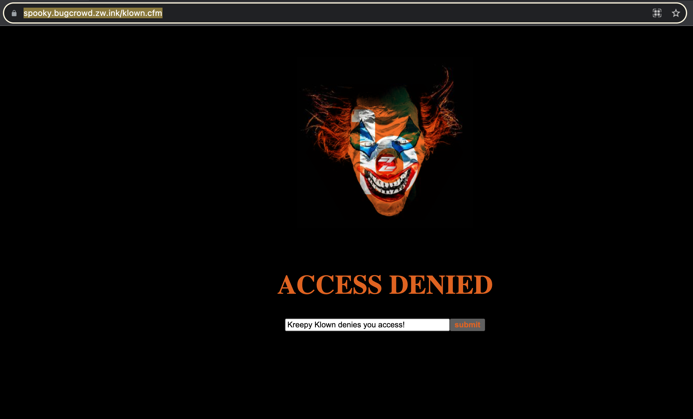
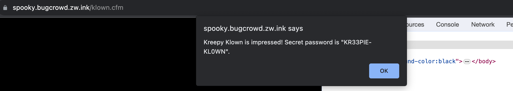
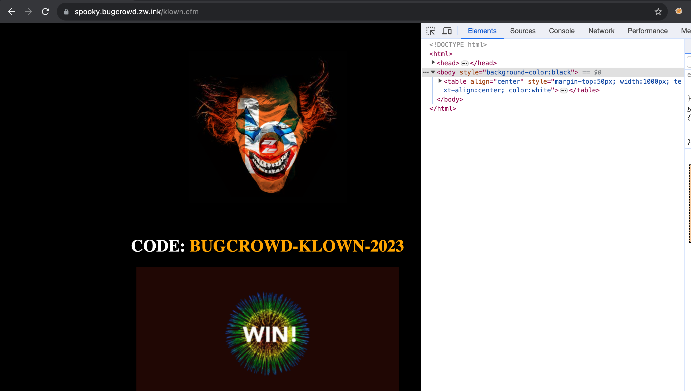

```
challenge URL: https://spooky.bugcrowd.zw.ink/klown.cfm
```

### Introduction

In this CTF challenge, you were presented with a mysterious web page at the given URL. The initial page seemed to have an inaccessible submit button, but with a little investigation, you were able to uncover a secret password. By following a series of steps, you successfully bypassed the security mechanism and retrieved the `CODE`. Let's walk through the solution:

## Solution:

1. **Initial Exploration:** 
	* Upon visiting the URL [https://spooky.bugcrowd.zw.ink/klown.cfm](https://spooky.bugcrowd.zw.ink/klown.cfm), you encountered a peculiar webpage.



2. **Hidden Button Element:**
	* You noticed a button element with the following attributes:

```
<input name="smile" type="submit" value="submit" disabled="true" style="color:#DF6322; font-weight:bold; cursor: not-allowed" title="Access Denied" id="smile">
```

* The button was initially disabled and appeared inaccessible.
	
3. **Button Activation:** 
	* You realized that the button could be activated by removing the disabled="true" attribute.
4. **Form Submission:**
	*  After removing the disabled="true" attribute, you submitted the form with a random input, 'dummy.'
5. **Alert Popup:**
	* Your action triggered a pop-up message that revealed the password:
		`Secret Password: KR33PIE-KL0WN`



6. **Input Password:**
	* You then input the secret password, `KR33PIE-KL0WN`, into the appropriate field, following the instructions provided in the pop-up.
	
	

7. **Final Flag:** 
	- After submitting the password, you received the final response:



